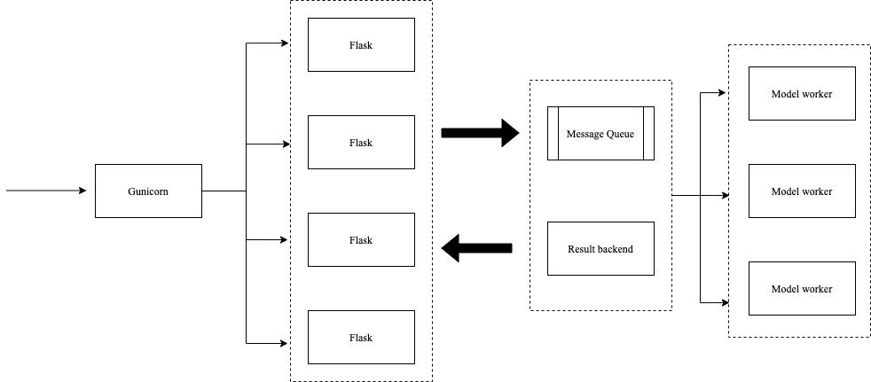

# Machine Learning Python Web Service 

python_web is a demo python web service for machine learning, the sample model in this repo is linear regression. Because [flask](https://www.palletsprojects.com/p/flask/) its own WSGI server is very simple and can not be used in production environment, So gunicorn is commonly used to manage the flask this kind of web application.  
[Gunicorn](https://gunicorn.org/) has a master worker, which can manage all of other slave workers. Every slave workers handle one flask application. In case master worker crash, we can utilize [supervisor](https://github.com/Supervisor/supervisor) to monitor all of gunicorn workers, and it will restart when workers die.  


It is a good idea to decouple the http server and machine learning model using message queue. In this project we use [celery](https://github.com/celery/celery) as our task queue. In the celery framework, we set rabbitmq as message broker, redis as result backend. Here is the framework of this project.  




## Build 

```shell script

    docker build -t python_web -f Dockerfile . 

    docker run -it --rm \
                    -p  8020:8020 \
                    -e WORKERS=2 \
                    python_web

```

## Test
```shell script
    curl http://127.0.0.1:8020/pricing?CRIM=2.8&ZN=10.211&INDUS=18.237
```
